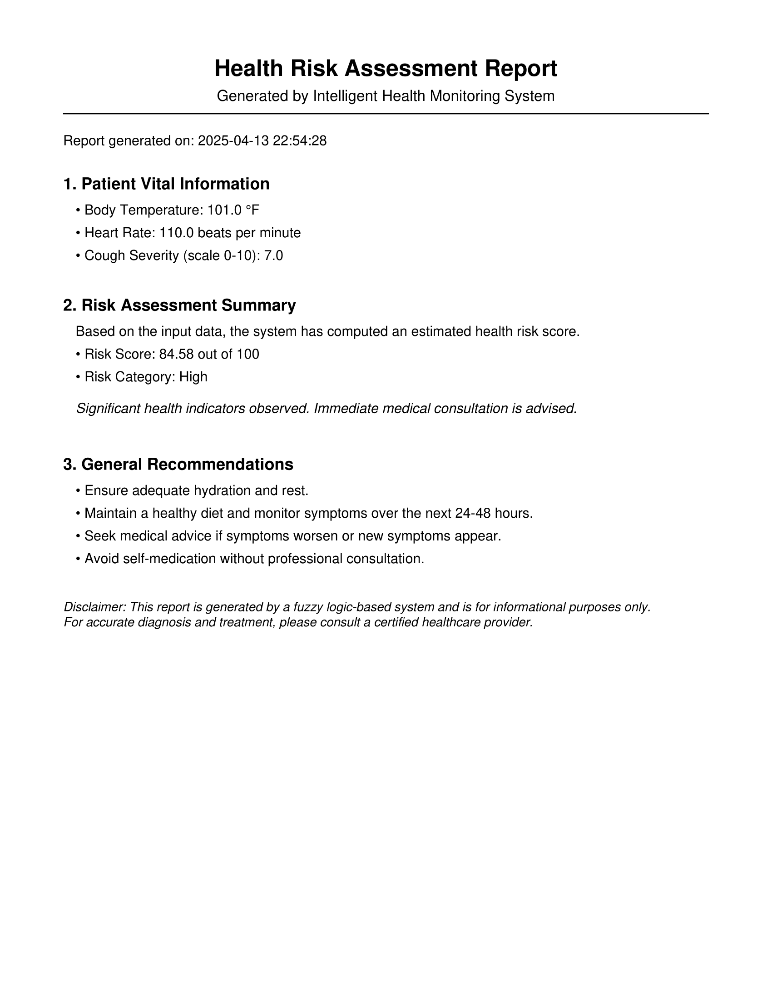

# 🩺 Health Risk Advisor

**Health Risk Advisor** is a fuzzy logic-based web tool designed to estimate a user's health risk level based on three key inputs:
- Body Temperature
- Heart Rate
- Cough Severity

The system utilizes fuzzy logic rules to classify the risk as **Low**, **Medium**, or **High**, and also allows users to **download a professional PDF health report** based on their inputs.

---

## 🚀 Live Demo

🔗 [Click here to access the live tool](https://health-risk-advisor.onrender.com/) 
_Replace this link with your deployed app's URL_

---

## 📸 Sample Report

A sample of the auto-generated health risk report:

  
_Replace `path_to_sample_report_image.png` with the actual path after uploading._

---

## 📂 Features

- 🔍 **Fuzzy Logic Engine** using `scikit-fuzzy`
- 📊 **Real-time Risk Analysis** (Low / Medium / High)
- 📃 **PDF Report Generation** with detailed inputs and timestamp
- 🧾 **CSV Logging** of each entry
- 🧠 Smart input validation for reliability
- 🌐 Responsive UI with Flask and Jinja2 templates

---

## 🧠 How It Works

Inputs are fuzzified using membership functions and then passed through a set of expert rules:

- **Temperature:** low, normal, high  
- **Heart Rate:** low, normal, high  
- **Cough Severity:** none, moderate, severe  
- **Risk Output:** low, medium, high

Based on combinations of these, the fuzzy inference system determines the health risk score and category.

---

## ⚙️ Technologies Used

- Python 3
- Flask
- scikit-fuzzy
- ReportLab (for PDF generation)
- HTML / CSS (Jinja templating)
- Bootstrap (optional for styling)
- CSV (for local logging)

---

## 📦 Installation Instructions

1. **Clone the Repository:**

   ```bash
   git clone https://github.com/yourusername/health-risk-advisor.git
   cd health-risk-advisor
